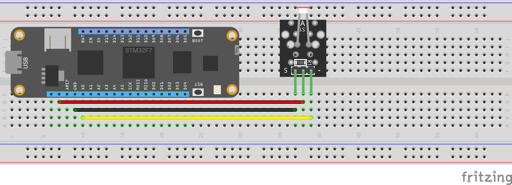

# Wilderness Labs Meadow F7v1

## Overview

This demo shows off how to use a Meadow F7 with .Net Standard and a micro-RTOS.

- [Meadow F7](https://store.wildernesslabs.co/collections/frontpage/products/meadow-f7)
  - [Pinout Diagram](http://developer.wildernesslabs.co/Meadow/Meadow_Basics/Hardware/F7v1/)
- [Elegoo 37 Piece Sensor Kit](https://www.elegoo.com/products/elegoo-37-in-1-sensor-kit)
- Learn more about .Net Standard on the Meadow board at <http://developer.wildernesslabs.co/Meadow/>.
  - To get this sample running, I used Visual Studio 2022 and followed the [Getting Started](http://developer.wildernesslabs.co/Meadow/Getting_Started/) instructions for getting the board setup and the device flashed with the latest firmware.  After that, it was pretty straight forward.

## Deployment

### Construction

1. Meadow F7
2. Photo Resistor Module

### Deploying to IoT Central

1. TBD - I did not have time to get this setup.

### Meadow

1. Wire up the board and sensors according the the fritzing diagram.
2. Follow the instructions for getting the Meadow running .Net Standard and recognized in Visual Studio.
3. Open the MeadowApplication.sln file in Visual Studio 2022.
4. Select your board in Meadow Devices.
5. Compile/deploy the code to the board.

## Learnings

- One of the main reasons I explored this framework is that I'm just not very good with writing C code.  C# and other more modern languages is where I'm comfortable.  I found the samples provided on the Meadow website to be very good, and the ability to use .Net Standard with sensors easy to use.  The Azure IoT SDK nuget should work very easily within this architecture, but I did not have a chance to explore it.
